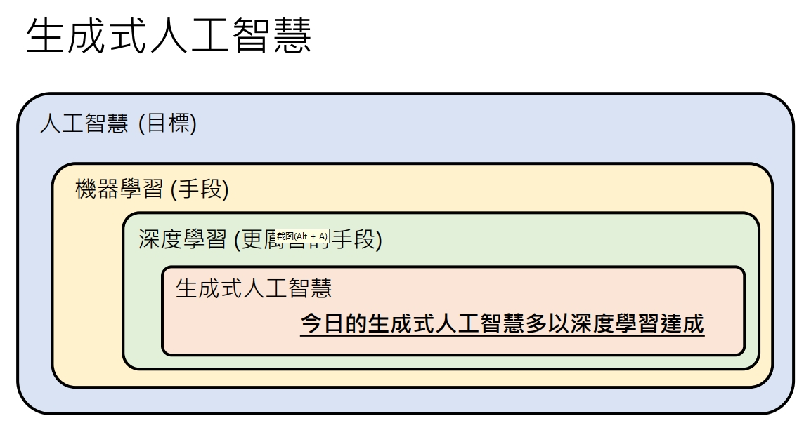

# 什么是生成式AI

## 一、定义
1. 生成式AI是一种人工智能技术，它可以根据用户的输入，生成具有一定语义和语法结构的文本或图像。生成式AI可以用于自然语言处理、语音识别、图像生成、视频生成、音乐生成等领域。
2. 机器学习\深度学习：机器自动从资料中找到一个pattern，然后利用这些pattern来预测未来的结果。
3. ChatGPT也就是一个函数，但有区别的是在推理任务中它可以输出“没有看到过的东西”。
  <!-- 新增图片引用 -->

## 二、发展历史

## 三、GPT的关键利器
### 1.预训练（自监督学习）
- 方法：利用网络大范围的数据，文本，做next token prediction的任务；
- 重要性：在104种语言中预训练的的模型，只用在某一种语言中进行fine-tune，最后的F1-score之比人类低3%； （参照：https://arxiv.org/abs/1909.09587）
### 2.监督式学习（SFT）
- 方法：利用大量目标文本数据，进行fine-tune；提供新的训练数据；
- 重要性：InstructGPT中用实验证明了，有SFT的model，哪怕参数量小，win rate也能比过参数量大的模型。
### 3.强化学习（Reinforcement Learning）
- 方法：从人类的反馈中学习，提高人类觉得好的答案的回复概率，降低人类觉得差的答案的回复概率。但是，模型要有一定的能力才适合进入RLHF；这也是为什么这一part放到最后。核心是训练一个reward model，这个model先根据人类的偏好，学会如何打分。 
- 步骤：
    1. 模型生成答案；
    2. 人类评估答案；
    3. 模型根据人类的评估结果，更新参数；
    4. 重复1-3步；
- 重要性：

### SFT和RL又被称为Alignment。

## 三、为什么work？

参考文献：
- [李宏毅 2024 春季生成式AI技术课程](https://speech.ee.ntu.edu.tw/~hylee/genai/2024-spring.php)

- [李沐论文精度系列之九：InstructGPT](https://zhuanlan.zhihu.com/p/639252063)